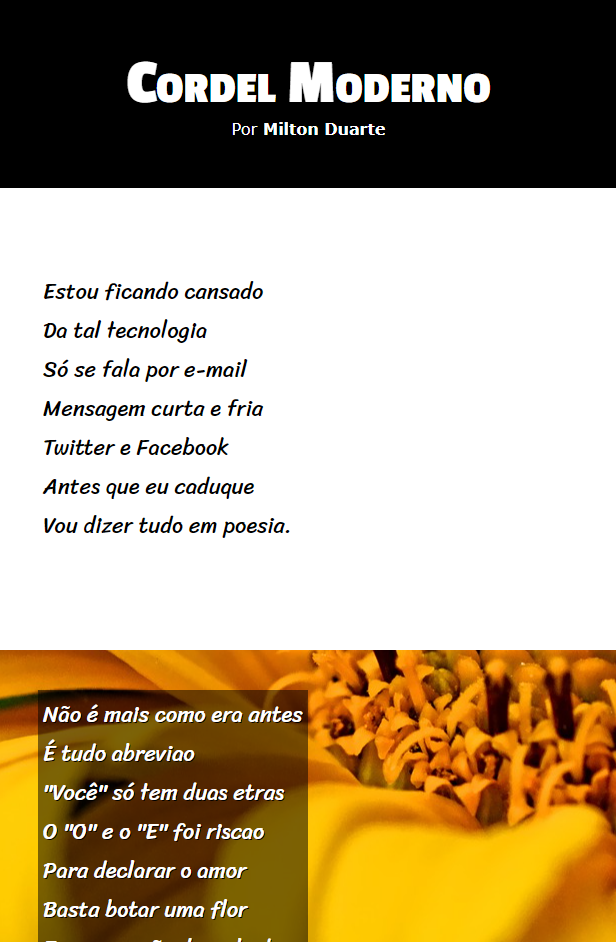

<h1 align="center"> Projeto Cordel </h1>

Projeto criado no curso de HTML e CSS do CursoemVideo.

  <a href="#-tecnologias">Tecnologias</a>&nbsp;&nbsp;&nbsp;|&nbsp;&nbsp;&nbsp;
  <a href="#-projeto">Projeto</a>&nbsp;&nbsp;&nbsp;|&nbsp;&nbsp;&nbsp;
  <a href="#-licença">Licença</a>

  

 

  

## 🚀 Tecnologias

Esse projeto foi desenvolvido com as seguintes tecnologias:

- HTML e CSS
- Git e Github
- Figma

## 💻 Projeto

O projeto Cordel é um projeto para praticar e treinar as tecnologias aprendidas no decorrer do curso. Acesse o projeto [AQUI](https://yuriverwiebe.github.io/projeto-cordel)

## 📝 Licença

Esse projeto está sob a licença MIT.

---

Feito com ♥ by Yuri Verwiebe 🌊
